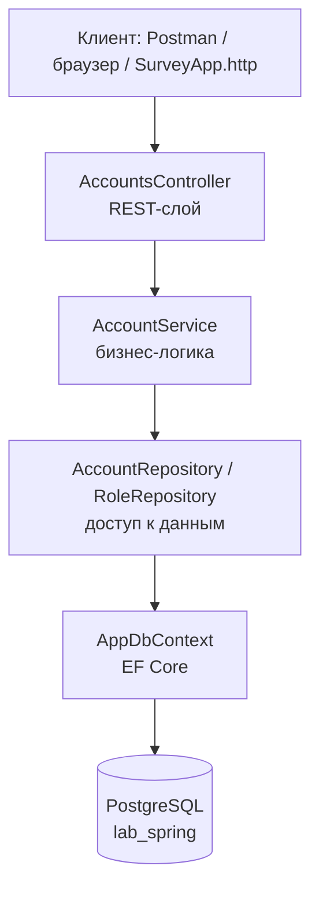
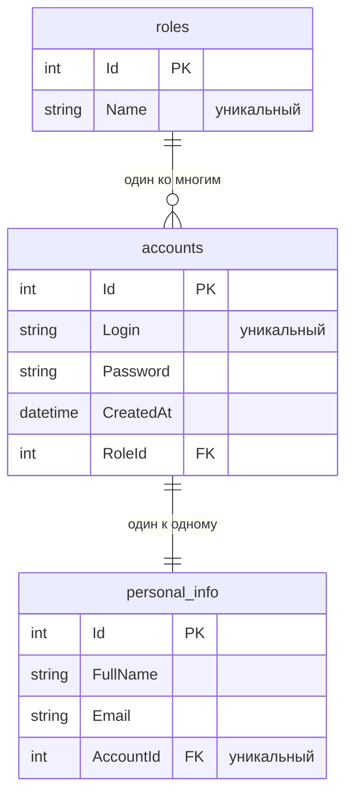

# SurveyApp — Лабораторная работа №2

[](https://dotnet.microsoft.com/)
[](https://www.postgresql.org/)

REST-сервис для работы с учётными записями пользователей: классическая трёхслойная
архитектура **Entity → Repository → Service → Controller**, ORM, реляционная СУБД и
автоматическая валидация входных данных.

Задание (см. `Lab_2.md`) было сформулировано для **Spring Boot (Java)**. Преподаватель
разрешил использовать любой язык и фреймворк, так как цель работы — общие приёмы
backend-разработки. Здесь те же сущности, та же слоистая архитектура и те же эндпоинты
реализованы на **ASP.NET Core (C#)**.

> Локальная работа №1 (голосование на Razor Pages + SQLite) сохранена в git-теге `lab-1`.
> Текущая ветка — `lab-2`.

## Что изменилось по сравнению с ЛР №1

| Было (ЛР №1) | Стало (ЛР №2) |
| --- | --- |
| Razor Pages (HTML-интерфейс) | REST API (JSON) |
| SQLite | PostgreSQL 16 |
| Страницы работали с `AppDbContext` напрямую | Слои Repository и Service, контроллер общается только с сервисом |
| Сущности `SurveyResponse`, `VoteOption`, `ResponseOption` | Сущности `Account`, `PersonalInfo` (один-к-одному), `Role` (многие-к-одному) |
| Валидация вручную на странице | Атрибуты валидации + автоматический ответ 400 |

## Соответствие Spring Boot и ASP.NET Core

| Spring Boot (Java) | Реализация в этом проекте |
| --- | --- |
| `spring-boot-starter-web`, `@RestController`, `@RequestMapping` | `Controllers/AccountsController.cs` с `[ApiController]` и `[Route]` |
| `spring-boot-starter-data-jpa`, Hibernate | Entity Framework Core + провайдер `Npgsql` |
| `@Entity` | Классы в `Models/` + `DbSet` в `AppDbContext` |
| `JpaRepository` + `@Query` | `Repositories/IAccountRepository.cs` и его реализация на LINQ |
| `@Service`, внедрение через конструктор | `Services/AccountService.cs`, регистрация в DI (`AddScoped`) |
| `spring-boot-starter-validation`, `@Valid`, `@NotBlank`, `@Email` | Атрибуты `[Required]`, `[StringLength]`, `[EmailAddress]` + авто-валидация в `[ApiController]` |
| `application.properties` (`spring.datasource.*`) | `appsettings.json` / `appsettings.Development.json` |
| `spring.jpa.hibernate.ddl-auto=update` | Миграции EF Core + `db.Database.Migrate()` при старте |
| `build.gradle` | `SurveyApp.csproj` |
| Spring Initializr | Шаблон ASP.NET Core Web API (`dotnet new web`) |
| `@ControllerAdvice`, `ResponseStatusException` | `Exceptions/ApiExceptionHandler.cs` (`IExceptionHandler`) |
| Postman | `SurveyApp.http` (встроенный HTTP-клиент) или `curl` |

## Архитектура приложения



Структура проекта:

```
SurveyApp/
├── Controllers/AccountsController.cs   # REST-контроллер /api/accounts
├── Services/                           # бизнес-логика (@Service)
│   ├── IAccountService.cs
│   └── AccountService.cs
├── Repositories/                       # доступ к данным (JpaRepository)
│   ├── IAccountRepository.cs
│   ├── AccountRepository.cs
│   ├── IRoleRepository.cs
│   └── RoleRepository.cs
├── Models/                             # сущности (@Entity)
│   ├── Account.cs
│   ├── PersonalInfo.cs
│   └── Role.cs
├── Dtos/                               # объекты запроса и ответа
│   ├── CreateAccountRequest.cs
│   └── AccountResponse.cs
├── Exceptions/                         # исключения и их превращение в HTTP-коды
│   ├── ApiExceptions.cs
│   └── ApiExceptionHandler.cs
├── Data/AppDbContext.cs                # контекст EF Core (аналог Hibernate SessionFactory)
├── Migrations/                         # миграции схемы БД
├── SurveyApp.http                      # готовые запросы для проверки API
└── appsettings.json                    # строка подключения к БД
```

## Модель данных



Особенности схемы:

* таблицы названы в snake_case (`accounts`, `personal_info`, `roles`) — как принято в PostgreSQL;
* у `personal_info.AccountId` уникальный индекс — это и есть связь «один к одному»;
* `accounts.Login` и `roles.Name` уникальны, дубликаты не появятся;
* при удалении аккаунта его персональные данные удаляются каскадом;
* роль удалить нельзя, пока на неё ссылается хотя бы один аккаунт (`RESTRICT`).

## REST API

| Метод | Адрес | Что делает | Коды ответа |
| --- | --- | --- | --- |
| `POST` | `/api/accounts` | Создать пользователя | `201`, `400`, `409` |
| `GET` | `/api/accounts` | Получить всех пользователей | `200` |
| `GET` | `/api/accounts?role=USER` | Кастомный запрос: поиск по роли | `200` |
| `GET` | `/api/accounts?fullName=иван` | Кастомный запрос: поиск по ФИО (без учёта регистра) | `200` |
| `GET` | `/api/accounts/{id}` | Получить одного пользователя | `200`, `404` |

Тело запроса `POST /api/accounts`:

```json
{
  "login": "user1",
  "password": "pass123",
  "personalInfo": {
    "fullName": "Иван Петров",
    "email": "ivan@mail.ru"
  },
  "role": {
    "name": "USER"
  }
}
```

Ответ `GET /api/accounts`:

```json
[
  {
    "id": 1,
    "login": "user1",
    "createdAt": "2026-09-17T09:25:46.344716Z",
    "personalInfo": { "id": 1, "fullName": "Иван Петров", "email": "ivan@mail.ru" },
    "role": { "id": 2, "name": "USER" }
  }
]
```

Важные детали:

* роль передаётся только названием: сервис ищет её в справочнике, а если такой роли нет —
  создаёт новую (поэтому повторные `POST` с `"name": "USER"` не плодят дубли ролей);
* пароль не попадает в ответ: наружу отдаётся `AccountResponse`, а не сущность;
* ошибки возвращаются в едином формате `ProblemDetails`:
  * `400` — данные не прошли валидацию (список ошибок по полям);
  * `409` — логин уже занят;
  * `404` — пользователь с таким `id` не найден.

## Настройка PostgreSQL

1. Убедитесь, что сервер PostgreSQL запущен, и создайте пустую базу:

   ```sql
   CREATE DATABASE lab_spring;
   ```

2. Пропишите доступ к базе. Пароль хранится только в локальном файле
   `appsettings.Development.json` (он добавлен в `.gitignore`, поэтому в репозиторий не попадает):

   ```json
   {
     "ConnectionStrings": {
       "DefaultConnection": "Host=localhost;Port=5432;Database=lab_spring;Username=postgres;Password=ваш_пароль"
     }
   }
   ```

   В общедоступном `appsettings.json` лежит тот же ключ с заглушкой `ВАШ_ПАРОЛЬ`.

## Запуск

```bash
dotnet restore
dotnet run
```

При старте приложение само приводит структуру таблиц к модели
(аналог `ddl-auto=update`) и заполняет справочник ролей значениями `ADMIN` и `USER`.
Сервер слушает `http://localhost:8080`.

## Проверка работы (пункт 7 задания)

Проще всего — открыть `SurveyApp.http` (Visual Studio или VS Code с расширением REST Client)
и нажимать «Send Request» над нужным запросом. Там уже описаны пять `POST` из задания,
`GET`-запросы, а также проверки ошибок `400`, `409` и `404`.

Через Postman: метод `POST`, адрес `http://localhost:8080/api/accounts`,
`Body → raw → JSON`, тело — из примера выше.

Из консоли можно проверить чтение:

```bash
curl http://localhost:8080/api/accounts
```

Кириллицу в теле `POST` из Git Bash лучше передавать через Postman или `SurveyApp.http`:
встроенный в Windows `curl.exe` получает аргументы командной строки в кодировке ANSI и
портит русские буквы, переданные прямо в `-d`.

В локальной базе эти 5 пользователей из задания уже созданы, чтобы можно было сразу
сделать скриншоты SQL-запроса и ответа `GET`.

## Чек-лист для сдачи

| № | Что нужно | Как получить |
| --- | --- | --- |
| 1 | Консоль с успешным стартом приложения | `dotnet run` |
| 2 | Результат `SELECT * FROM accounts;` | pgAdmin / DBeaver / `psql -d lab_spring` |
| 3 | Ответ `GET /api/accounts` | браузер или `SurveyApp.http` |

## Заметки и возможные улучшения

* Пароль в учебном проекте хранится в открытом виде — как в задании. В реальном
  приложении его нужно хешировать (`BCrypt`, ASP.NET Core Identity) и не отдавать
  в `GET`-ответах (сейчас в ответе его и нет — используется DTO).
* Дальше логично добавить: JWT-аутентификацию, `PUT`/`DELETE` для аккаунтов,
  пагинацию списка, автотесты (xUnit + `WebApplicationFactory`).
