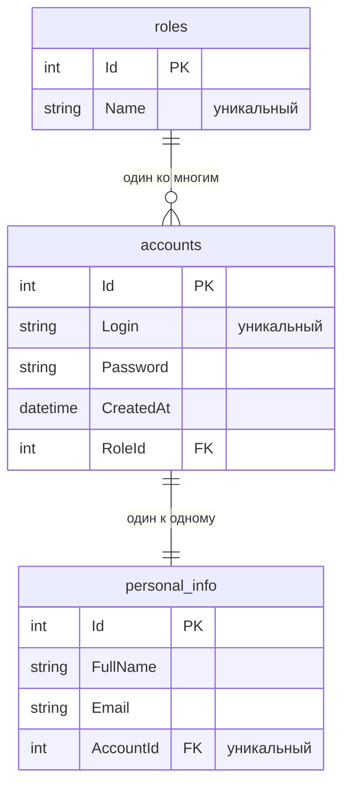

# Лабораторная работа №2: REST API

[](https://dotnet.microsoft.com/)
[](https://www.postgresql.org/)

Веб-сервис на ASP.NET Core для работы с учётными записями пользователей: создание,
чтение и поиск по связанным данным. Реализован по трёхслойной схеме
**Entity → Repository → Service → Controller**.

## Стек

* **.NET 10 / ASP.NET Core** — REST API на контроллерах
* **Entity Framework Core + Npgsql** — ORM, провайдер PostgreSQL
* **PostgreSQL 16** — СУБД
* **DataAnnotations** — валидация входящих данных (ответ `400` собирается автоматически)
* **ProblemDetails** — единый формат ошибок (`404`, `409`)

## Структура проекта

```
SurveyApp/
├── Controllers/AccountsController.cs   # REST-контроллер /api/accounts
├── Services/                           # бизнес-логика
├── Repositories/                       # доступ к данным
├── Models/                             # сущности Account, PersonalInfo, Role
├── Dtos/                               # объекты запроса и ответа
├── Exceptions/                         # исключения -> HTTP-коды
├── Data/AppDbContext.cs                # контекст EF Core
├── Migrations/                         # миграции схемы БД
├── SurveyApp.http                      # готовые запросы для проверки API
└── docs/                               # задание и отчёт
```

## Модель данных



* `PersonalInfo` связан с `Account` один-к-одному, при удалении аккаунта удаляется каскадом.
* Роль — справочник (`ADMIN`, `USER`, …), у неё много аккаунтов; `RESTRICT` не даёт удалить
  роль, пока на неё ссылаются.

## API

| Метод | Адрес | Назначение |
| --- | --- | --- |
| `POST` | `/api/accounts` | Создать пользователя |
| `GET` | `/api/accounts` | Список всех пользователей |
| `GET` | `/api/accounts?role=USER` | Поиск по роли |
| `GET` | `/api/accounts?fullName=иван` | Поиск по ФИО (без учёта регистра) |
| `GET` | `/api/accounts/{id}` | Один пользователь по `id` |

Запрос:

```json
{
  "login": "user1",
  "password": "pass123",
  "personalInfo": { "fullName": "Иван Петров", "email": "ivan@mail.ru" },
  "role": { "name": "USER" }
}
```

Ответ:

```json
[
  {
    "id": 1,
    "login": "user1",
    "createdAt": "2026-09-17T09:25:46.344716Z",
    "personalInfo": { "id": 1, "fullName": "Иван Петров", "email": "ivan@mail.ru" },
    "role": { "id": 2, "name": "USER" }
  }
]
```

Роль передаётся только названием: сервис находит её в справочнике или создаёт новую,
поэтому повторные запросы с `"name": "USER"` не плодят дубликаты. Пароль в ответ не
попадает — наружу отдаётся `AccountResponse`, а не сущность.

Коды ошибок: `400` — не прошла валидация, `409` — логин уже занят, `404` — нет такого `id`.

## Запуск

1. Создать пустую базу:

   ```sql
   CREATE DATABASE lab_spring;
   ```

2. Указать доступ к базе в `appsettings.Development.json` (файл в `.gitignore`, в репозиторий
   не попадает):

   ```json
   {
     "ConnectionStrings": {
       "DefaultConnection": "Host=localhost;Port=5432;Database=lab_spring;Username=postgres;Password=ваш_пароль"
     }
   }
   ```

3. Запустить:

   ```bash
   dotnet restore
   dotnet run
   ```

Приложение слушает `http://localhost:8080`, при старте само создаёт таблицы по миграциям
и заполняет справочник ролей значениями `ADMIN` и `USER`.

## Проверка API

В файле [SurveyApp.http](SurveyApp.http) написаны примеры запросов. Можно запустить прямо из Visual Studio.
