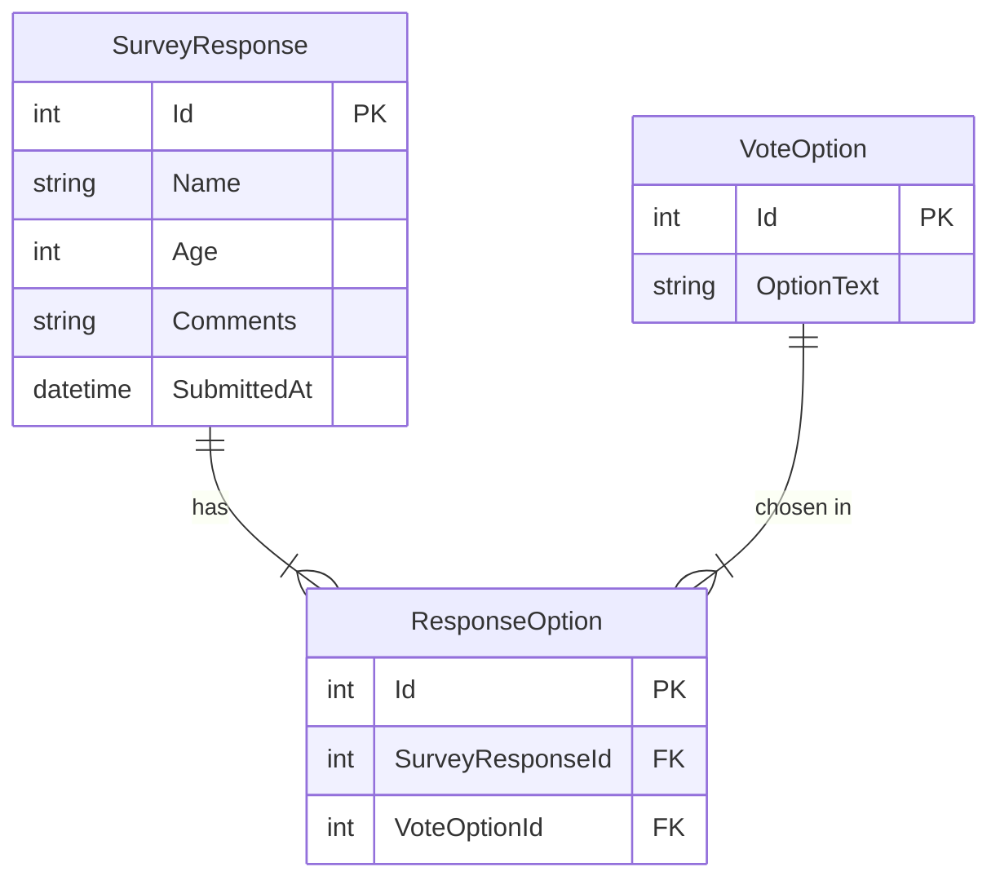

# Лабораторная работа №1: Базовая архитектура Web-приложения

[](https://dotnet.microsoft.com/)
[](https://www.sqlite.org/index.html)

Веб-сервис на платформе **ASP.NET Core Razor Pages** для проведения голосования за предпочтительный backend-стек технологий. Приложение позволяет пользователям выбирать несколько вариантов одновременно и просматривать актуальную статистику.

## Технологический стек
* **Backend:** .NET 10.0 / ASP.NET Core (Razor Pages)
* **ORM:** Entity Framework Core (Code-First)
* **Database:** SQLite
* **Frontend:** HTML5, CSS3, Bootstrap 5, Vanilla JS

## Функционал приложения
1. **Множественное голосование:** Поддержка выбора нескольких вариантов через чекбоксы.
2. **Сбор данных:** Валидация имени, возраста и текстового комментария респондента.
3. **Live-статистика:** Отображение результатов статистики и процентным соотношением.
4. **Адаптивность:** Корректное отображение на мобильных устройствах и персональных компьютерах.

## Архитектура базы данных

В проекте используется реляционная база данных **SQLite**. Для реализации связи «Многие-ко-Многим» (один пользователь может выбрать много стеков, один стек могут выбрать много пользователей) применяется явная промежуточная сущность.

### ER-Диаграмма (Mermaid)



### Описание моделей:
1. **`SurveyResponse`**: Хранит анкетные данные пользователя и метку времени.
2. **`VoteOption`**: Справочник. При отсутствии данных заполняется 9 записями в `.\Program.cs` списокм backend-технологий:
```cs
// Seed
using (var scope = app.Services.CreateScope())
{
    var db = scope.ServiceProvider.GetRequiredService<AppDbContext>();
    db.Database.Migrate();

    if (!db.VoteOptions.Any())
    {
        db.VoteOptions.AddRange(
            new VoteOption { OptionText = "Spring Boot (Java)" },
            new VoteOption { OptionText = "FastAPI (Python)" },
            new VoteOption { OptionText = "Django (Python)" },
            new VoteOption { OptionText = "NestJS (TypeScript)" },
            new VoteOption { OptionText = "Express.js (JavaScript)" },
            new VoteOption { OptionText = "Laravel (PHP)" },
            new VoteOption { OptionText = "ASP.NET Core (C#)" },
            new VoteOption { OptionText = "Ruby on Rails (Ruby)" },
            new VoteOption { OptionText = "Gin (Go)" }
        );
        db.SaveChanges();
    }
}
```
3. **`ResponseOption`**: Связующая таблица. На уровне БД настроен **уникальный индекс** по паре `(SurveyResponseId, VoteOptionId)`, что предотвращает дублирование голосов за одну технологию в рамках одной анкеты.

## Запуск проекта

### Предварительные требования
* [.NET SDK 10+](https://dotnet.microsoft.com/download)
* [Git](https://git-scm.com/)

### Пошаговая инструкция

1. **Клонируйте репозиторий:**
   ```bash
   git clone <url-вашего-репозитория>
   cd SurveyApp
   ```

2. **Восстановите зависимости и примените миграции:**
   ```bash
   dotnet restore
   dotnet ef database update
   ```
   *При первом запуске база данных автоматически заполнится списком из 9 фреймворков.*

3. **Запустите приложение:**
   ```bash
   dotnet run
   ```

4. **Откройте в браузере:**
   Перейдите по адресу `http://localhost:5054` (или другому порту, указанному в консоли).

